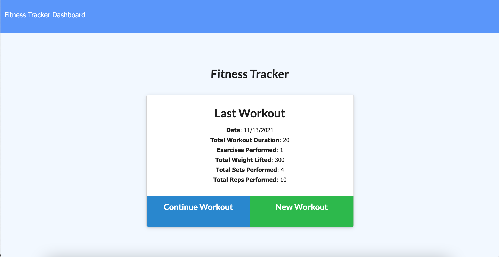
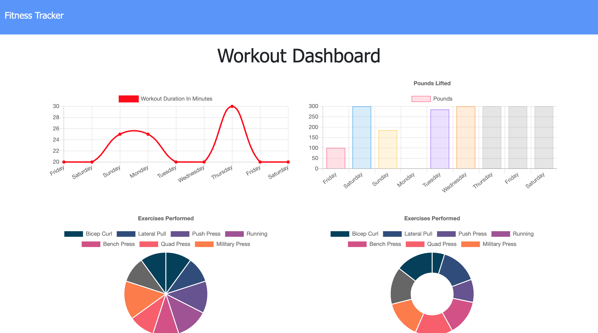

# Fitness Tracker App

The goal of this app is to provide the user with a way to track workouts. The app builds the database with MongoDB and with the help of MongoDB Atlas is deployed via a Heroku web page.

## Getting Started

The user will need to clone the repository from GitHub and run the command `npm install` on their command line, after install user will need to run `node seeders/seed.js` to seed the database with the sample exercises and `node server.js` to turn on the server.

## Deployed Link

* [See Live Site](https://tranquil-lake-00499.herokuapp.com/)
* [See GitHub Repo](https://github.com/maweiche/fitnessTracker)

## Authors

* **Matt Weichel** 

- [Link to Github](https://github.com/maweiche)

## License

This project is licensed under the MIT License 

## Acknowledgments

* Hat tip to anyone whose code, libraries, packages, or UI was used  / inspired from
